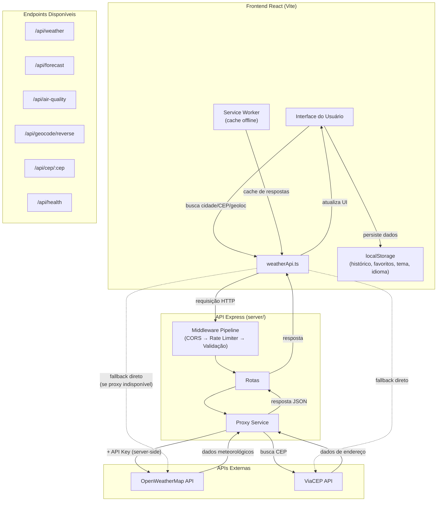

# Diagrama de Fluxo da Aplicação — Temperatura Local

## Fluxo de Requisição

1. O usuário interage com a interface (busca, geolocalização, favoritos)
2. O `weatherApi.ts` tenta enviar a requisição ao backend proxy
3. O backend aplica CORS, rate limiting e validação de parâmetros
4. A rota correspondente encaminha ao Proxy Service
5. O Proxy Service adiciona a API Key e faz a requisição à API externa
6. A resposta retorna ao frontend sem expor a chave
7. Se o proxy estiver indisponível, o frontend faz a chamada diretamente (fallback)

## Dados em Memória (Frontend)

| Dado | Armazenamento | Chave |
|------|---------------|-------|
| Histórico de buscas | localStorage | `temperatura-local-history` |
| Cidades favoritas | localStorage | `temperatura-local-favorites` |
| Tema (claro/escuro) | localStorage | `temperatura-local-theme` |
| Idioma selecionado | localStorage | `temperatura-local-lang` |
| Cache de API | Service Worker | Cache API (stale-while-revalidate) |
| Tiles do mapa | Service Worker | Cache API (24h TTL) |
