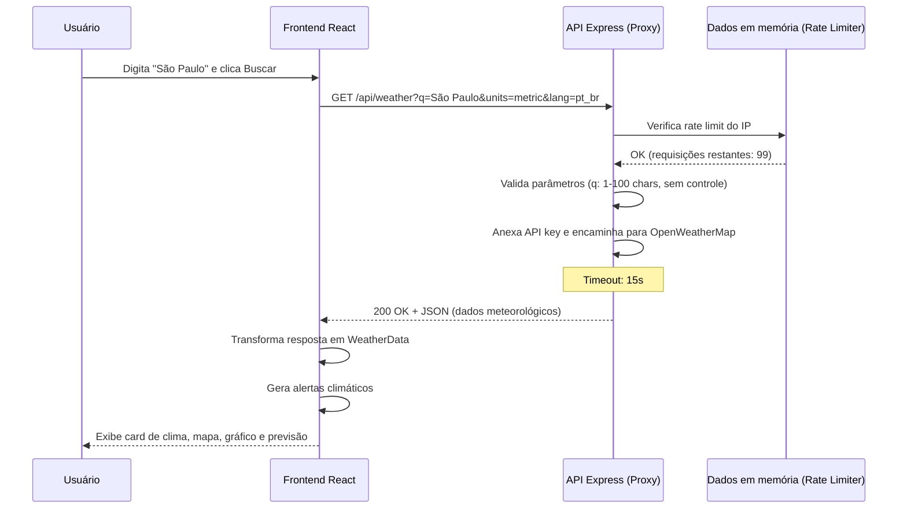
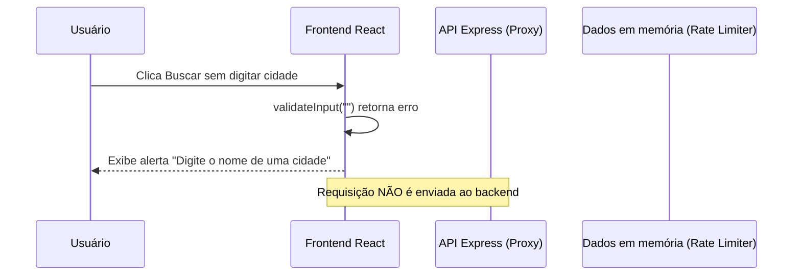
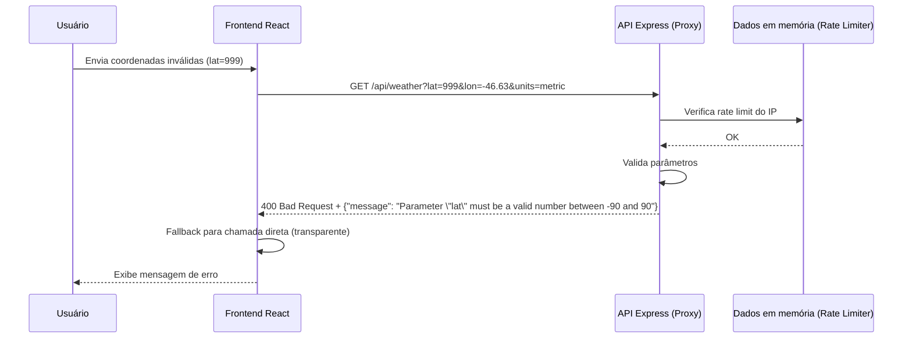
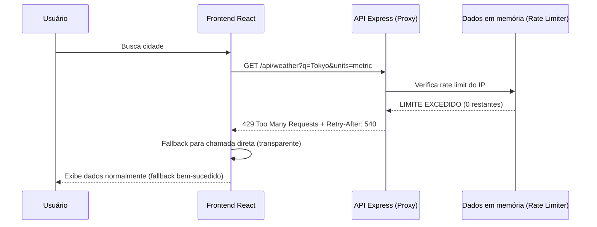
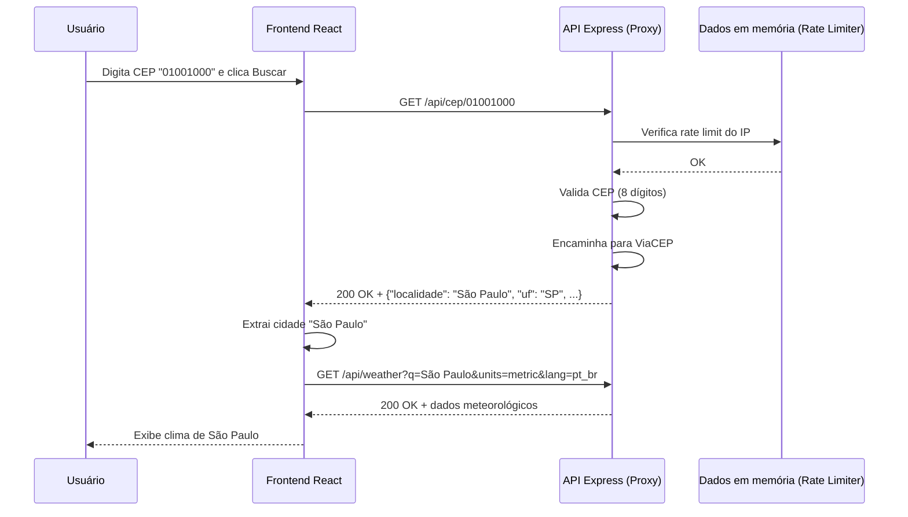
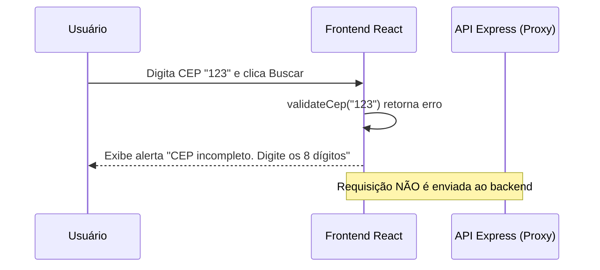

# Diagrama de Sequência — Temperatura Local

## Fluxo: Buscar clima por cidade (sucesso)

## Fluxo: Buscar clima por cidade (erro — campo obrigatório ausente)

## Fluxo: Buscar clima por coordenadas (erro — parâmetro inválido)

## Fluxo: Rate limit excedido

## Fluxo: Buscar CEP (sucesso)

## Fluxo: Buscar CEP (erro — formato inválido)

