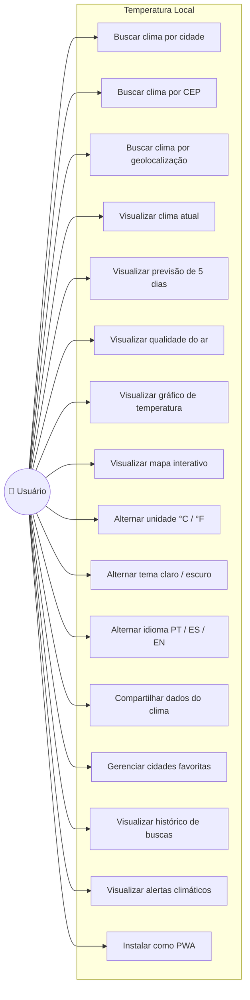

# Diagrama de Caso de Uso — Temperatura Local

```mermaid
flowchart LR
    Usuario(("👤 Usuário"))

    subgraph TemperaturaLocal["Temperatura Local"]
        UC1["Buscar clima por cidade"]
        UC2["Buscar clima por CEP"]
        UC3["Buscar clima por geolocalização"]
        UC4["Visualizar clima atual"]
        UC5["Visualizar previsão de 5 dias"]
        UC6["Visualizar qualidade do ar"]
        UC7["Visualizar gráfico de temperatura"]
        UC8["Visualizar mapa interativo"]
        UC9["Alternar unidade °C / °F"]
        UC10["Alternar tema claro / escuro"]
        UC11["Alternar idioma PT / ES / EN"]
        UC12["Compartilhar dados do clima"]
        UC13["Gerenciar cidades favoritas"]
        UC14["Visualizar histórico de buscas"]
        UC15["Visualizar alertas climáticos"]
        UC16["Instalar como PWA"]
    end

    Usuario --> UC1
    Usuario --> UC2
    Usuario --> UC3
    Usuario --> UC4
    Usuario --> UC5
    Usuario --> UC6
    Usuario --> UC7
    Usuario --> UC8
    Usuario --> UC9
    Usuario --> UC10
    Usuario --> UC11
    Usuario --> UC12
    Usuario --> UC13
    Usuario --> UC14
    Usuario --> UC15
    Usuario --> UC16
```
